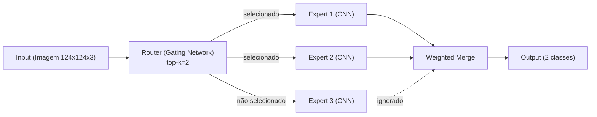

<h1 align="center" style="font-weight: bold;">Mixture of Experts (MoE) PKLot 🚗</h1>

    
    
    
    
    

  <a href="#sobre">Sobre</a> •
  <a href="#arquitetura">Arquitetura</a> • 
  <a href="#pkLot">Base de Dados PKLot</a> •
  <a href="#experimentos">Experimentos</a> •
  <a href="#uso">Como Usar</a> •
  <a href="#resultados">Resultados</a>

  <i>Implementação de Mixture of Experts com roteador sparse para classificação de vagas de estacionamento, testando diferentes arquiteturas de experts.</i>

---

<h2 id="sobre">📋 Sobre o Projeto</h2>

Este projeto implementa uma arquitetura **Mixture of Experts (MoE)** para detecção de vagas de estacionamento utilizando a base de dados **PKLot** e **CNR-Park**. O objetivo é investigar como diferentes arquiteturas de experts impactam o desempenho do modelo, permitindo análise comparativa de diversos designs de redes neurais.

**Características principais:**
- ✅ Arquitetura MoE com roteador sparse (top-k selection)
- ✅ Suporte a múltiplos experts com arquiteturas customizáveis
- ✅ Treino, validação e teste automáticos
- ✅ Cálculo de métricas (Loss, Acurácia)
- ✅ Compatível com GPU e CPU

---

<h2 id="arquitetura">🧠 Arquitetura MoE</h2>

### Componentes Principais

### Componentes

1. **Router (Gating Network)**
   - Seleciona os top-k melhores experts para cada entrada
   - Economiza computação (sparse routing)
   - Saída: weights para cada expert

2. **Experts (CNNs independentes)**
   - Múltiplas CNNs especializadas
   - Cada uma processa a entrada independentemente
   - Saída: logits de classificação

3. **Merge (Weighted Sum)**
   - Combina saídas dos experts usando pesos do router
   - Produz classificação final

---

<h2>🤝 Autor</h2>
<table align="left">
  <tr>
    <td align="left">
      <a href="https://www.linkedin.com/in/lucasdoc/">
                
         
          <b>Lucas Cunha</b>
        
      </a>
    </td>
  </tr>
</table>
